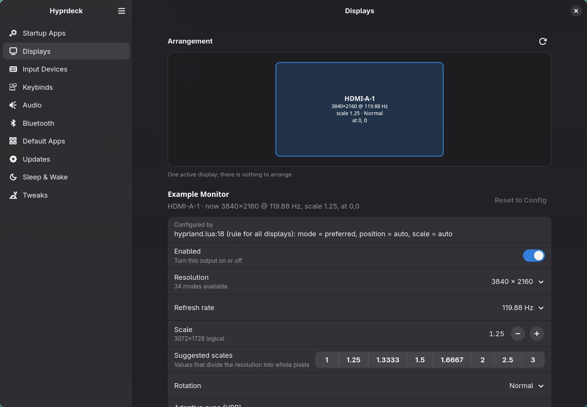
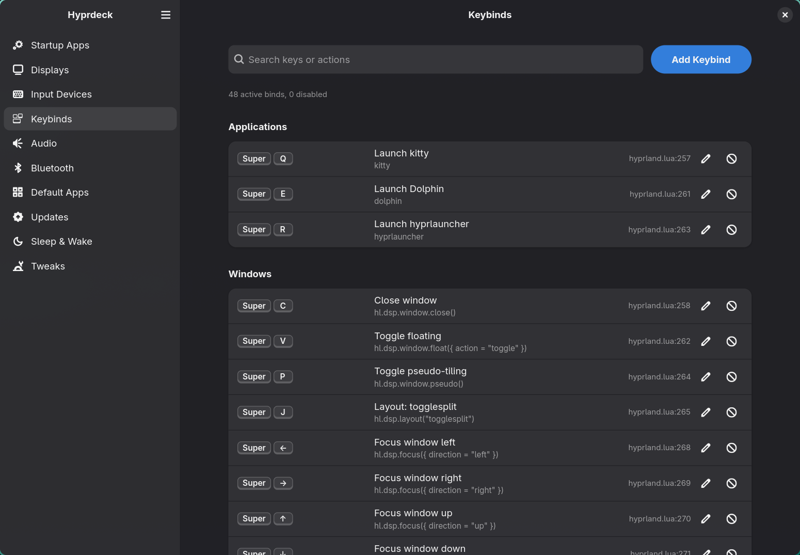
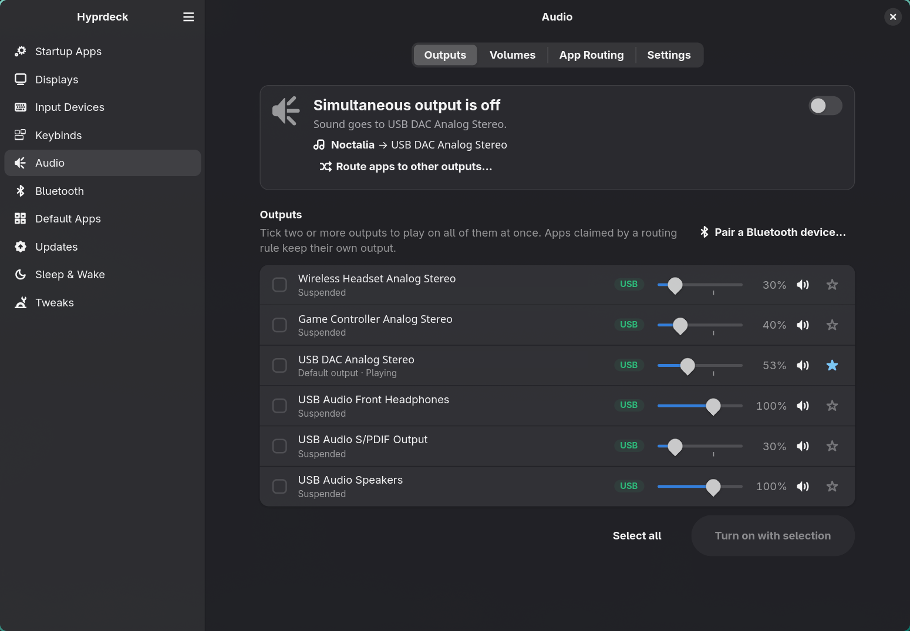
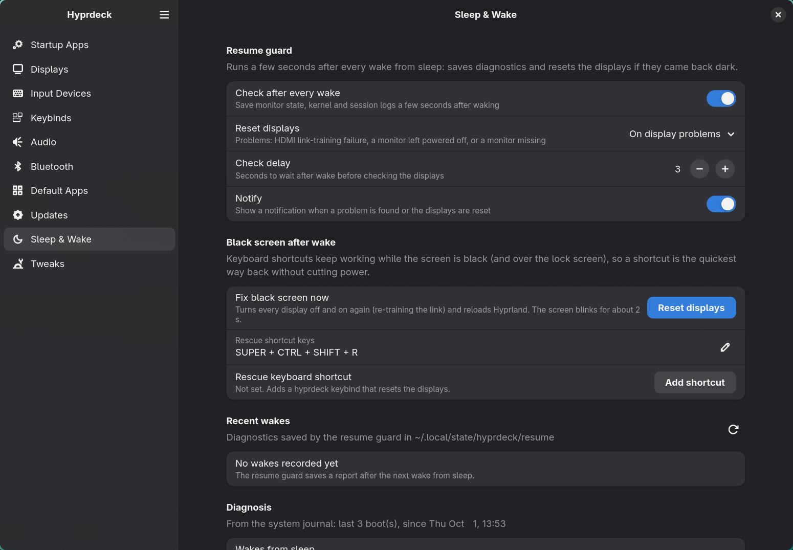

# Hyprdeck

A control center for [Hyprland](https://hypr.land) desktops. Manage startup apps, displays, input and
keybinds, audio, Bluetooth, default apps, package updates, and sleep/wake recovery in one GTK4/libadwaita
app. It lives in your tray from login.

Hyprdeck reads your **Lua** Hyprland config (Hyprland 0.56+). It evaluates it against a recording mock
of the `hl` API, so every bind, rule and option shows the file and line it comes from, even when built
from variables, loops and `require`s. Your own changes go to one generated file, `hyprdeck.lua`, which
loads last. Your hand-written config is never rewritten behind your back.

<p align="center">
  
  
  
  
</p>

## Features

| Page | What it does |
| --- | --- |
| **Startup Apps** | XDG autostart entries, systemd user services and `hl.on("hyprland.start")` commands in one list. Enable/disable for the next login, start/stop/restart now, view logs, add apps, and delete entries you own (with a preview of every file removed). |
| **Displays** | Drag-to-arrange layout. Resolution, refresh rate, scale (only values Hyprland accepts), rotation, VRR, mirroring, color management and HDR (SDR brightness/saturation/luminance, EOTF, bit depth, ICC). Changes apply behind a 15 s keep-or-revert countdown. Brightness, contrast and input source over DDC/CI via `ddcutil`. |
| **Input Devices** | Keyboard layouts, options and repeat; pointer, focus and touchpad behaviour; cursor; overrides per physical device. Every value shows where it comes from: config file:line, hyprdeck, or default. |
| **Keybinds** | Every effective bind in readable form, grouped and searchable. Add, edit, disable and restore binds. Record key combos (even ones Hyprland already grabs). Pick an app, a shell action, a window/workspace action or any dispatcher. Warns before replacing an existing bind. |
| **Audio** | Play through several outputs at once (a PipeWire combine sink) and route specific apps to specific outputs. Includes volumes, default output, a "what's playing where" overview, and a tray submenu. |
| **Bluetooth** | Scan, pair (PIN/passkey dialogs), trust, connect, rename, block and forget devices, with battery levels. Tray submenu. |
| **Default Apps** | Default browser, mail, files, editor, image/video/music players, documents, archives and terminal (`xdg-terminal-exec`). Detects and fixes "mixed" handlers. Can sync Hyprland launcher variables such as `$BROWSER`. Advanced per-MIME-type and URL-scheme editor. |
| **Updates** | Repo and AUR updates (`checkupdates`, `paru`/`yay`) with background checks and notifications. Compares detected components (Hyprland, Noctalia, Quickshell, Waybar, hyprlock, …) to their upstream GitHub releases, and switches to or from `-git` packages. Updates Hyprdeck itself (AppImage self-update or source rebuild). |
| **Sleep & Wake** | A resume guard saves diagnostics after every wake. If a display comes back dark (for example after an HDMI FRL link-training failure), it resets the display with a DPMS cycle and reload. Also: a "fix black screen" button and optional keybind, journal-based wake history, and GPU power-management checks. |
| **Tweaks** | Game mode (runtime only), config health (errors, overridden options and binds), Hyprland log viewer. Corsair/OpenLinkHub resume tuning when present. |

Pages and sections adapt to what's installed: missing `ddcutil`, `bluetoothd`, `pacman`, an AUR helper,
uwsm, Noctalia or an NVIDIA driver hides or explains the related features instead of failing.

## Requirements

- Hyprland **0.56+** with a Lua config (`~/.config/hypr/hyprland.lua`)
- A StatusNotifierItem tray host (Noctalia, Waybar, ironbar, …) for tray mode
- Optional:
  - PipeWire + `pipewire-pulse` (`pactl`) for audio
  - BlueZ for Bluetooth
  - `ddcutil` with i2c access for monitor brightness
  - Arch Linux or an Arch-based distro with `pacman-contrib` (plus `paru` or `yay` for the AUR) for the Updates page
- Building from source: Rust 1.88+, GTK ≥ 4.20, libadwaita ≥ 1.8

## Install

### AppImage

Download `Hyprdeck-x86_64.AppImage` from the [latest release](https://github.com/mikkeyboi/hyprdeck/releases/latest):

```sh
mkdir -p ~/.local/opt/hyprdeck ~/.local/bin && cd ~/.local/opt/hyprdeck
curl -fLO https://github.com/mikkeyboi/hyprdeck/releases/latest/download/Hyprdeck-x86_64.AppImage
curl -fLO https://github.com/mikkeyboi/hyprdeck/releases/latest/download/Hyprdeck-x86_64.AppImage.sha256
sha256sum -c Hyprdeck-x86_64.AppImage.sha256 && chmod +x Hyprdeck-x86_64.AppImage
ln -sf "$PWD/Hyprdeck-x86_64.AppImage" ~/.local/bin/hyprdeck
```

The AppImage is built on Arch Linux and needs a similarly recent glibc. The Updates page can update it in
place.

### From source

```sh
git clone https://github.com/mikkeyboi/hyprdeck && cd hyprdeck
./install.sh --enable   # release build, installs binary, desktop file, icon and user service
```

Run `./install.sh` again to update. The Updates page has a "Rebuild…" button for this.

### Start at login

`install.sh --enable` installs and enables `hyprdeck.service`, which starts with
`graphical-session.target` (uwsm and other systemd-managed sessions). For an AppImage install, or a session
without systemd integration, follow **[docs/AI_INSTALL.md](docs/AI_INSTALL.md)**. It is a step-by-step guide
written so an AI assistant can do the setup for you, and humans can follow it too.

By default the service starts in the tray (**Preferences → Start minimized**). Closing the window keeps
Hyprdeck in the tray; quit from the tray menu. Running `hyprdeck` again, or `hyprdeck --page <id>`,
focuses the running instance.

## Command line

```
hyprdeck --help
hyprdeck --page display               # open on a page (startup, display, input, keybinds, audio,
                                      #   bluetooth, defaults, updates, sleep, tweaks)
hyprdeck display rescue               # DPMS off/on + reload: recovers a black screen after wake
hyprdeck audio toggle                 # simultaneous output on/off
hyprdeck defaults set browser firefox.desktop
hyprdeck tweaks gamemode toggle
hyprdeck updates check
hyprdeck system diagnose
```

## Files

| Path | Purpose |
| --- | --- |
| `~/.config/hyprdeck/*.toml` | Settings, one file per feature |
| `~/.config/hypr/hyprdeck.lua` | Generated from `hyprland.toml`. `hyprland.lua` gets `require("hyprdeck")` appended the first time you apply a setting |
| `~/.local/state/hyprdeck/` | Resume diagnostics, update report, release cache |

Hand-written config is only edited when you explicitly ask for it, and only the one line involved:
disabling a startup command comments out its line, and Default Apps edits a launcher variable.

**Coming from HyprMod?** Your `hyprland-gui.lua` settings are imported on first apply. The file is moved
to `~/.config/hyprdeck/backup/`.

## Development

The project is a Cargo workspace:

- `crates/core`: tokio↔GTK bridge, `hyprctl` wrappers, the Lua config model, the managed Lua module, the
  option schema (parsed from Hyprland's `hl.meta.lua` stubs), the tray registry and UI helpers.
- `crates/<feature>` (`startup`, `display`, `input`, `audio`, `bluetooth`, `defaults`, `updates`, `system`):
  each exports `pages()`, `start_background()` and `cli()`.
- `src/`: window shell, tray host, CLI router.

```sh
cargo test --workspace
cargo clippy --workspace --all-targets -- -D warnings
cargo run -p hd-display --example display_preview   # one feature's pages, standalone
packaging/appimage/build-appimage.sh                # build dist/Hyprdeck-x86_64.AppImage
```

CI runs fmt, clippy, tests and an AppImage build in an Arch Linux container. Pushing a `v*` tag that
matches the crate version publishes a release with the AppImage and its checksum.

Issues and pull requests are welcome. Include `hyprdeck --version`, `hyprctl version | head -1` and
relevant `journalctl --user -u hyprdeck` output in bug reports.

## License

[MIT](LICENSE)
